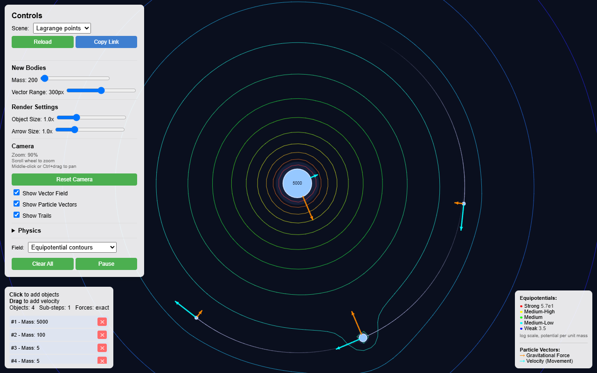
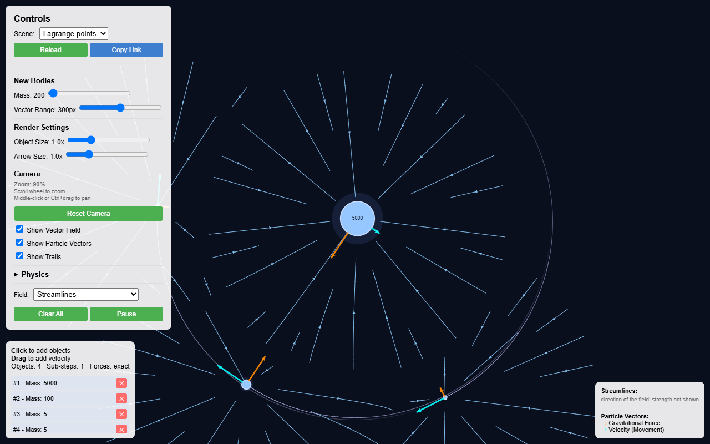
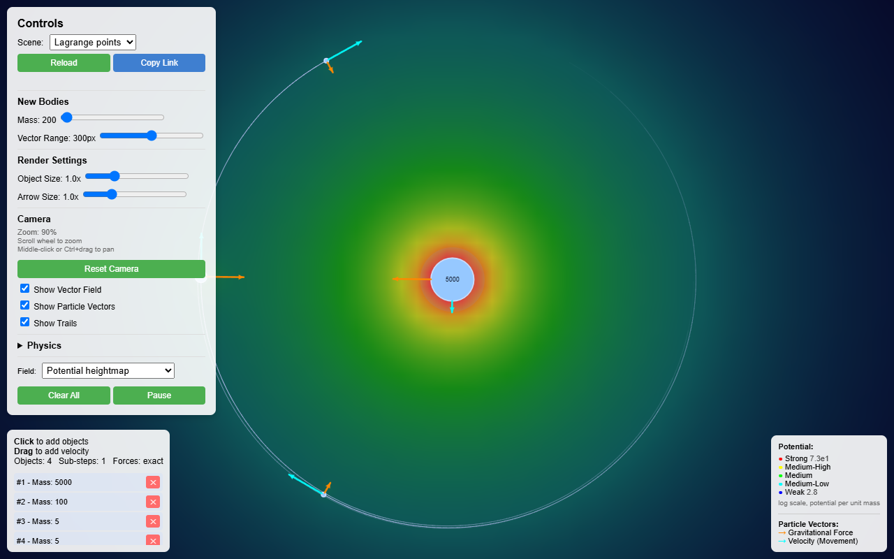
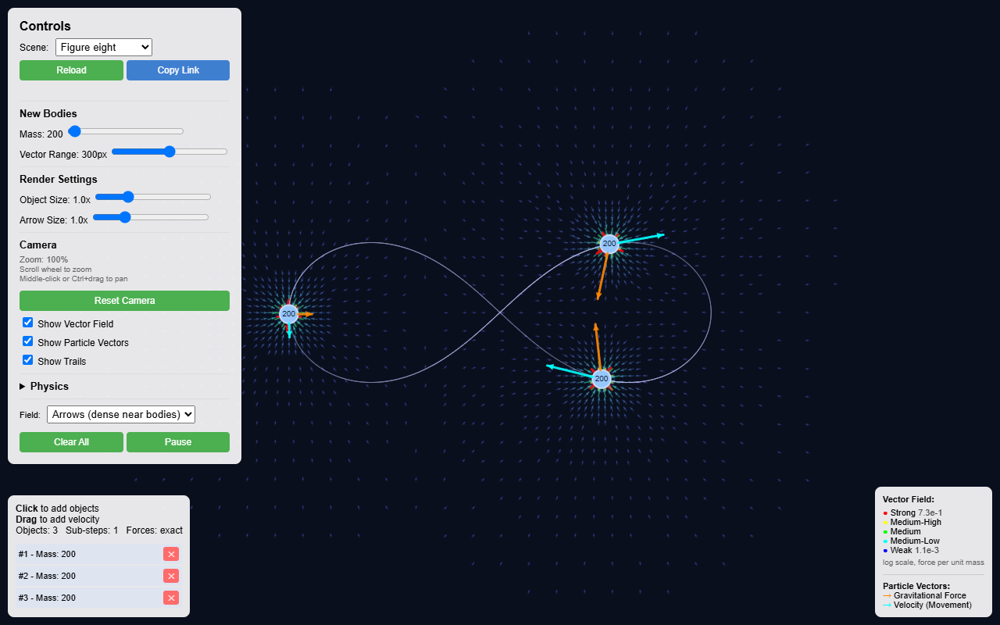

# Gravity Simulator

An interactive 2D N-body gravity simulator that draws the gravitational field
itself, not just the bodies moving through it. TypeScript and p5.js.

[](https://github.com/Dimitriuses/gravity-simulator/actions/workflows/ci.yml)
[](https://github.com/Dimitriuses/gravity-simulator/actions/workflows/pages.yml)


[](ROADMAP.md)
[](LICENSE)

**[▶ Live demo](https://dimitriuses.github.io/gravity-simulator/)** — runs
entirely in the browser, nothing to install. Deployed from `master` by
[`pages.yml`](.github/workflows/pages.yml).


## What it does

Place bodies with the mouse and watch them interact under Newtonian gravity.
The distinguishing feature is the **field visualization**: the gravitational
field is sampled across visible space and drawn as a grid of arrows, coloured
and sized by strength, so the shape of the potential well is visible rather than
inferred from how things move.

- **N-body simulation** — every body attracts every other, `F = G·m₁·m₂/r²`,
  softened at contact distance so a close pass stays finite.
- **Three integration schemes**, switchable while running — velocity Verlet
  (the default), symplectic Euler and RK4 — with adaptive sub-stepping that
  slices a frame as finely as the closest pair needs.
- **Contacts are resolved**: bodies merge on contact by default, conserving mass
  and momentum, or bounce inelastically, or pass through — whichever you pick.
- **Scales to hundreds of bodies** through a Barnes-Hut quadtree, which answers
  the net force on a body, the field at a sample point, which bodies are
  touching, and how finely the frame needs slicing — all from one tree.
- **Seven starting scenes** — a circular binary, a star with two planets, the
  figure-eight three-body choreography, an eccentric comet, trojans parked at
  the L4 and L5 Lagrange points, a hyperbolic slingshot, and a 300-body galaxy.
  Every velocity is derived from the orbit equation for the simulator's own `G`,
  and each scene is run through the engine in the test suite to prove it still
  orbits thousands of steps later.
- **Scenes travel in a link.** **Copy Link** writes the live configuration —
  every body where it actually is, plus the camera and the physics settings —
  into the URL fragment, and opening that URL restores it.
- **Six ways to draw the field.** Three arrow modes — *gradient* (the default,
  which subdivides only where the field changes), *adaptive* (four density zones
  per body) and *uniform* (a regular lattice) — plus **equipotential contours**,
  which show the saddle between two bodies and the curve that closes around
  both, a **potential heightmap** that shades the same scalar as terrain, and
  **streamlines**, which follow the flow instead of sampling it.
- **A legend that says what the colours are worth.** Arrow length and hue are
  normalized against the range present in each frame, so the legend prints that
  range — strong and weak, in force per unit mass — and updates it every frame.
- **Per-body vectors** — net gravitational force (orange) and velocity (cyan),
  drawn on each body.
- **Camera** — wheel zoom about the cursor (10%–500%) and drag-to-pan. The field
  is resampled for whatever is on screen.
- **Trails**, adjustable mass, field range, body scale and arrow scale, and a
  pause that keeps the force arrows live so you can inspect a frozen
  configuration.

| | |
|---|---|
|  |  |
| **Uniform arrows** — an even lattice, better for reading overall structure | **Drag to launch** — the drag vector sets initial velocity |
|  |  |
| **Drag to launch** — the drag vector sets initial velocity | **Per-body vectors** — orange force, cyan velocity |

| | |
|---|---|
|  |  |
| **Equipotentials** — the level sets of the potential, pinching around the second body | **Streamlines** — the flow itself, evenly spaced |
|  |  |
| **Heightmap** — the same potential as shaded ground, deep wells bright | **Adaptive arrows** — four density zones around every body |



The **Figure eight** scene: three equal masses chasing each other around one
closed curve, a solution found by Chenciner and Montgomery in 2000. The trail is
one full period long, which is what makes the curve a curve rather than an arc.

## Controls

| Input | Action |
|---|---|
| **Left-click drag** on empty space | Place a body; the drag direction and length set its initial velocity |
| **Left-click** (no drag) | Place a stationary body |
| **Middle-drag**, or **Ctrl + left-drag** | Pan the view |
| **Scroll wheel** | Zoom about the cursor, 10%–500% |
| **Reset Camera** | Back to origin at 100% |
| **✕** next to a body in the list | Delete that body |
| **Clear All** / **Pause** | Empty the scene / freeze it |
| **Scene** dropdown | Load a starting scene; the camera reframes to fit it |
| **Reload** | Rebuild the current scene from scratch |
| **Copy Link** | Put the scene as it stands into the address bar, and on the clipboard |
| **Physics** section | Switch integration scheme, turn adaptive sub-stepping off, choose what happens on contact, or force the exact force solver |

Mass, field range, body size and arrow size are sliders in the control panel;
the *Field* dropdown switches between the six ways of drawing it. Bodies you add yourself inherit
the loaded scene's trail length, so they leave the same length of trail as the
ones that were already there.

## How it works

The simulation core is plain TypeScript with no p5 dependency, which is what
makes it testable without a browser:

```
main.ts             p5 sketch: input, UI wiring, frame loop
  ├── Camera            zoom/pan, screen<->world, visible world rectangle
  ├── PhysicsEngine     particle list, pairwise forces, integration
  │     ├── Particle       state, F=ma, force law, trail
  │     └── VectorField    field sampling (uniform | adaptive) + OccupancyGrid
  ├── presets           starting scenes and the orbit arithmetic behind them
  ├── integrators       Euler / Verlet / RK4 + the adaptive step rule
  │     └── forces         the softened force law, and accelerations at any positions
  ├── collisions        merge / bounce / pass through, at contact distance
  ├── quadtree          Barnes-Hut: forces, field, contacts, step size
  ├── serialization     scenes as text, for the URL fragment
  ├── contours          marching squares over any scalar field
  ├── streamlines       evenly spaced curves through any vector field
  └── Renderer        all canvas drawing
        └── Vector2D     immutable 2D vector maths
```

Two details worth calling out:

**Three integrators, and the step adapts.** The default is velocity Verlet:
second-order, symplectic, and — because the acceleration it computes to finish
one step is the one the next step opens with — **one force evaluation per step,
the same as the first-order scheme it replaced**. Symplectic Euler and RK4 are
selectable beside it, RK4 deliberately so: it is fourth-order and *not*
symplectic, so its energy error accumulates in one direction where the other
two oscillate within a bound. Measured at 44 steps per orbit, RK4's energy
excursion grows 0.10% → 0.51% → 1.04% over 100, 500 and 1,000 orbits while
Verlet's sits at 0.0097% and stays there.

Each frame is then sliced into as many sub-steps as the closest interacting pair
needs, from its dynamical and crossing timescales. A wide orbit asks for one, so
the common case costs nothing; a tight pass gets sub-stepped instead of silently
degrading. [`INTEGRATORS.md`](INTEGRATORS.md) has the full comparison —
`npm run compare` regenerates it.

**A shared link is untrusted input.** Decoding treats it that way: unknown keys
are ignored so a later version of the format can add fields, a version from the
future is refused rather than guessed at, and every number, setting and body
count is validated before any of it is applied. A link that cannot be read says
what was wrong with it rather than quietly showing the default scene, which
would look exactly like the link having worked.

**The contour and streamline tracers know nothing about gravity.** Both take a
function — a scalar at a point, or a vector at a point — and return geometry.
That is what makes them testable against fields whose answers are known in
closed form: a cone's level sets are circles of a radius you can write down, and
a rotating field's streamlines are circles about the origin. Neither would be
checkable by eye on a gravitational potential.

**One tree, four questions.** The quadtree in
[`src/quadtree.ts`](src/quadtree.ts) is built once per force evaluation and then
answers the net force on each body, the field at each sample point, which bodies
are close enough to touch, and how finely the frame has to be sliced. Only the
first two are approximations — the contact query and the step-size search use
the tree's bounds to prune a search whose answer is exactly what the pairwise
scan would give, which the tests check directly. Setting the opening angle to
zero makes the force sums exact too, and that is what the traversal is tested
against.

**Preset scenes are arithmetic, not coordinates.** A scene is initial
conditions, and initial conditions typed in by hand do not orbit: the original
opening scene gave its two bodies twice their circular speed, which is above the
pair's mutual escape velocity, and their separation grew from 400 units to
14,735 over 20,000 steps without anyone noticing. Every velocity in
[`src/presets.ts`](src/presets.ts) comes out of an orbit equation — `v =
sqrt(G·M/r)` for a circular orbit, vis-viva for the comet's eccentric one, a
published solution rescaled to this engine's `G` for the figure eight — and
every scene is then run through the real `PhysicsEngine` in
`tests/presets.test.ts` for thousands of steps and checked against what it
claims to be.

**Adaptive sampling deduplicates through a spatial hash.** Where two bodies'
zones overlap, a candidate sample is rejected if an accepted one already sits
within half a grid step on both axes. That test was a linear scan over every
accepted sample — quadratic in sample count, and the dominant cost of a frame.
`OccupancyGrid` answers the same question in roughly constant time;
`tests/OccupancyGrid.test.ts` checks it against the naive scan over thousands of
queries so the optimisation is provably behaviour-preserving.

## Running it

Requires Node 22 (see [`.nvmrc`](.nvmrc)).

```bash
npm install
npm run dev        # http://localhost:3000
```

```bash
npm run build      # -> dist/
npm run preview    # serve the build
```

`npm run dev` uses esbuild and **does not typecheck**. Run `npm run typecheck`
before trusting a change.

## Tests

```bash
npm run typecheck   # tsc over src, tests and the vite config
npm test            # 216 unit tests, headless, ~13s
npm run smoketest   # build first, then drive dist/ in headless Chromium
npm run screenshots # the same run, regenerating screenshots/
npm run compare     # integrator accuracy tables -> INTEGRATORS.md
npm run bench       # scaling and quadtree accuracy -> SCALING.md
```

The unit tests cover the whole simulation core — vector maths, the force law and
its softening, camera transforms, both field sampling modes, the conservation
laws through a collision, and every preset scene run forward for thousands of
steps — under Node with no DOM. The
integrators get the treatment they need: each is checked against the closed form
for a constant field, then against its own convergence order by halving the step
and watching the error fall by 2, 4 and 16, and finally over 500 orbits to
confirm which schemes bound their energy error and which does not.

The smoke test covers what only exists once pixels are on a canvas: it serves
the real build over HTTP, drives it with genuine mouse and wheel events, and
**judges colour by sampling the canvas backing store rather than by eye**. It
asserts 73 properties, including that the background is the intended navy, that
force and velocity arrows actually render, that a body created by dragging has
the mass the slider shows, that a click on a control places *no* body, that the
field still draws after panning far from the origin, that every scene in the
dropdown loads a live configuration, that switching integration scheme
mid-flight keeps the simulation running, that the particle list notices a body
that merged away without anyone clicking anything, that a three-hundred-body
scene loads and animates on the tree, that a shared link reopens the scene it
was made from, that each way of drawing the field produces its own picture, and
that the two left-hand panels stay clear of each other in a short window. Every
one of those corresponds to a defect that had shipped.

Both run in CI, on Linux and Windows.

## Deploying

The demo is live at
**<https://dimitriuses.github.io/gravity-simulator/>**, deployed from
[`.github/workflows/pages.yml`](.github/workflows/pages.yml) on every push to
`master`. `vite.config.ts` sets `base: './'`, so the build works unchanged from
a project sub-path.

**If you fork this:** set Settings → Pages → Source → **GitHub Actions**
*before* pushing. Selecting it first makes the first deploy succeed on
attempt 1.

## Known limitations

Measured, not guessed. [`KNOWNISSUES.md`](KNOWNISSUES.md) has the numbers.

- **Tight orbits are less accurate**, though far less so than they were. A
  fixed step resolves an orbit at radius 400 with 1,005 points and one at
  radius 50 with 44; adaptive sub-stepping now subdivides the tight ones, and
  the radius excursion at r = 50 falls from 14.2% (the original fixed-step
  Euler) to 0.11%. There is a floor on how badly a *physical* orbit can be
  resolved — about 25 steps per orbit, since a body cannot orbit inside the
  primary's own radius. [`INTEGRATORS.md`](INTEGRATORS.md) has the numbers.
- **Collisions are crude.** Merging is perfectly inelastic and irreversible,
  bodies carry no rotation, and contact is a discrete overlap test rather than a
  swept one — so a body moving further than the contact window in a single
  sub-step can still pass through. Adaptive sub-stepping is what keeps that
  rare.
- **Arrow length is frame-relative.** Magnitudes span ~10⁶, so arrows are
  normalized logarithmically against the range present in the current frame. The
  legend now prints that range, so the picture can be read in absolute terms —
  but the lengths themselves still cannot be compared between frames, and there
  is no ruler on the canvas.
- **Nothing is saved automatically.** A scene travels in a link, but only if you
  press Copy Link first; a plain refresh still loses it.
- **Desktop only.** The controls need three mouse buttons, a wheel and Ctrl.
  The page runs on a phone but cannot be panned or zoomed.
- **Hundreds of bodies, not thousands.** The quadtree took the frame from
  O(n²); what limits it now is drawing, and a field that samples up to 12,000
  points however few bodies there are. The 300-body Galaxy preset holds 30fps in
  Chromium. [`SCALING.md`](SCALING.md) has the tables.
- **The tree is an approximation.** At the default opening angle its median
  force error is around 0.03–0.2%, and because it is not symmetric it gives up
  exact momentum conservation. The exact solver stays the default below 128
  bodies and can be forced at any size.

## Roadmap

Active development. [`ROADMAP.md`](ROADMAP.md) covers contact physics beyond
merging (rotation, swept detection), the costs that are still superlinear, and
checking the simulation against real ephemeris data — plus what is deliberately
deferred, and why.

## Licence

MIT — see [`LICENSE`](LICENSE).

p5.js is LGPL-2.1 and is redistributed in the build output; the build emits it
as a separate, replaceable chunk for that reason. See [`NOTICE.md`](NOTICE.md).
Everything in [`screenshots/`](screenshots/) is generated from this project by
`npm run screenshots`.
