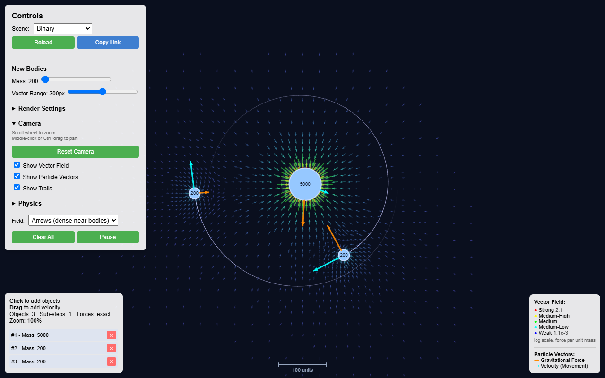
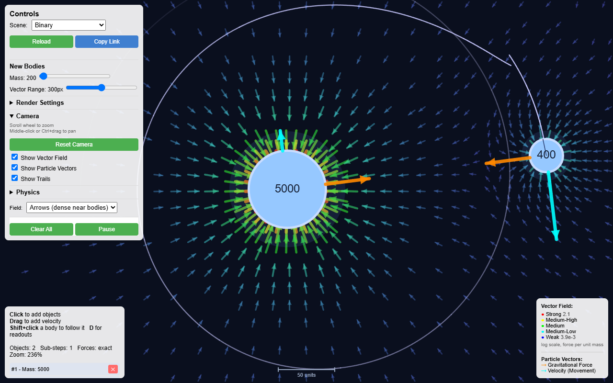
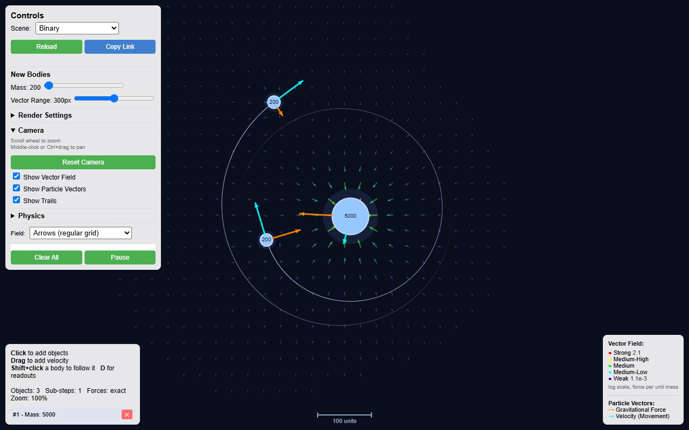
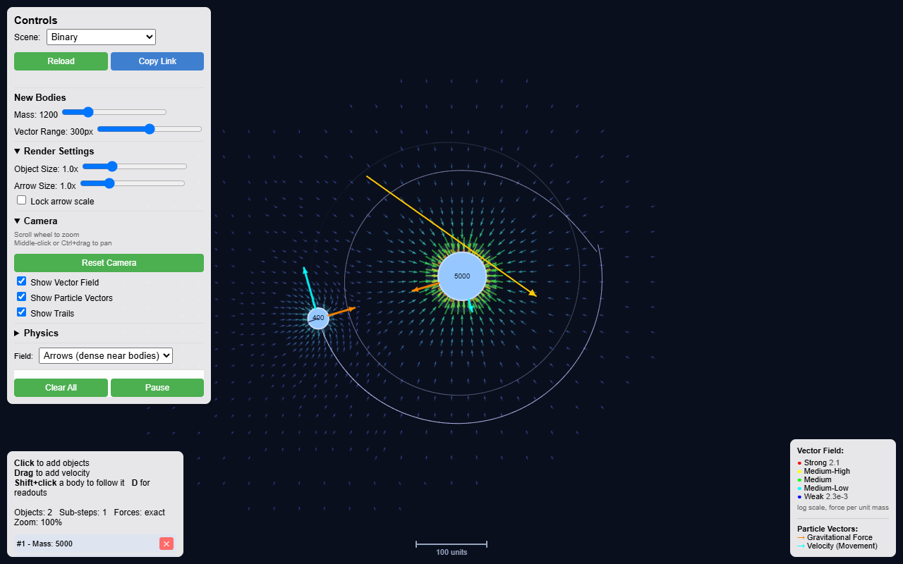
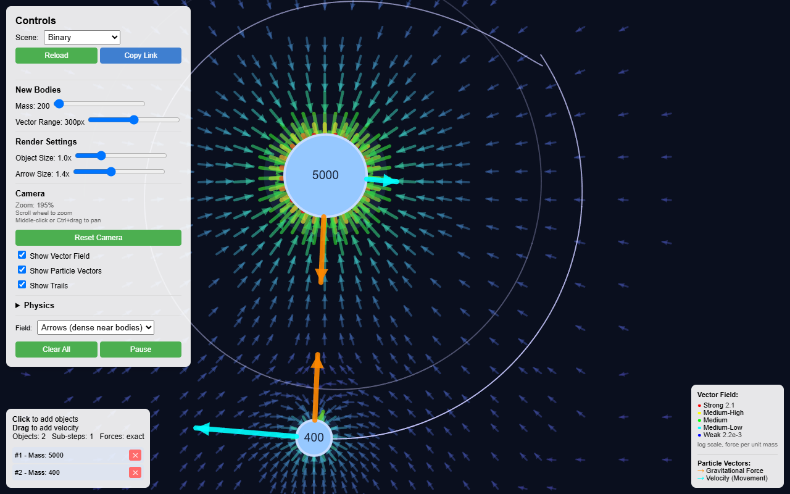

# Gravity Simulator

An interactive 2D N-body gravity simulator that draws the gravitational field
itself, not just the bodies moving through it. TypeScript and p5.js.

[](https://github.com/Dimitriuses/gravity-simulator/actions/workflows/ci.yml)
[](https://github.com/Dimitriuses/gravity-simulator/actions/workflows/pages.yml)


[](ROADMAP.md)
[](LICENSE)

**[▶ Live demo](https://dimitriuses.github.io/gravity-simulator/)** — runs
entirely in the browser, nothing to install. Deployed from `master` by
[`pages.yml`](.github/workflows/pages.yml).



## What it does

Place bodies with the mouse and watch them interact under Newtonian gravity.
The distinguishing feature is the **field visualization**: the gravitational
field is sampled across visible space and drawn as a grid of arrows, coloured
and sized by strength, so the shape of the potential well is visible rather than
inferred from how things move.

- **N-body simulation** — every body attracts every other, `F = G·m₁·m₂/r²`,
  softened at contact distance so a close pass stays finite.
- **Two field sampling modes.** *Adaptive* concentrates samples near bodies,
  where the field has structure, using four density zones and deduplicating
  where zones overlap. *Uniform* lays a regular lattice across the view, which
  reads the overall topology better.
- **Per-body vectors** — net gravitational force (orange) and velocity (cyan),
  drawn on each body.
- **Camera** — wheel zoom about the cursor (10%–500%) and drag-to-pan. The field
  is resampled for whatever is on screen.
- **Trails**, adjustable mass, field range, body scale and arrow scale, and a
  pause that keeps the force arrows live so you can inspect a frozen
  configuration.

| | |
|---|---|
|  |  |
| **Adaptive** — samples cluster where the field changes fastest | **Uniform** — even lattice, better for reading overall structure |
|  |  |
| **Drag to launch** — the drag vector sets initial velocity | **Per-body vectors** — orange force, cyan velocity |

## Controls

| Input | Action |
|---|---|
| **Left-click drag** on empty space | Place a body; the drag direction and length set its initial velocity |
| **Left-click** (no drag) | Place a stationary body |
| **Middle-drag**, or **Ctrl + left-drag** | Pan the view |
| **Scroll wheel** | Zoom about the cursor, 10%–500% |
| **Reset Camera** | Back to origin at 100% |
| **✕** next to a body in the list | Delete that body |
| **Clear All** / **Pause** | Empty the scene / freeze it |

Mass, field range, body size and arrow size are sliders in the control panel;
the *Grid Mode* dropdown switches sampling mode.

## How it works

The simulation core is plain TypeScript with no p5 dependency, which is what
makes it testable without a browser:

```
main.ts             p5 sketch: input, UI wiring, frame loop
  ├── Camera            zoom/pan, screen<->world, visible world rectangle
  ├── PhysicsEngine     particle list, pairwise forces, integration
  │     ├── Particle       state, F=ma, force law, trail
  │     └── VectorField    field sampling (uniform | adaptive) + OccupancyGrid
  └── Renderer        all canvas drawing
        └── Vector2D     immutable 2D vector maths
```

Two details worth calling out:

**Integration is semi-implicit (symplectic) Euler** — velocity is advanced
first, then position using the *new* velocity. That makes it symplectic, so
energy oscillates within a bound rather than growing: over 1000 orbits at radius
200, orbital energy moved 0.017% and the radius stayed within 198.2–201.8. The
error appears as phase (~0.066°/orbit), not as a spiral. What it does *not*
survive is a tight orbit at a fixed step — see
[Known limitations](#known-limitations).

**Adaptive sampling deduplicates through a spatial hash.** Where two bodies'
zones overlap, a candidate sample is rejected if an accepted one already sits
within half a grid step on both axes. That test was a linear scan over every
accepted sample — quadratic in sample count, and the dominant cost of a frame.
`OccupancyGrid` answers the same question in roughly constant time;
`tests/OccupancyGrid.test.ts` checks it against the naive scan over thousands of
queries so the optimisation is provably behaviour-preserving.

## Running it

Requires Node 22 (see [`.nvmrc`](.nvmrc)).

```bash
npm install
npm run dev        # http://localhost:3000
```

```bash
npm run build      # -> dist/
npm run preview    # serve the build
```

`npm run dev` uses esbuild and **does not typecheck**. Run `npm run typecheck`
before trusting a change.

## Tests

```bash
npm run typecheck   # tsc over src, tests and the vite config
npm test            # 73 unit tests, headless, ~1s
npm run smoketest   # build first, then drive dist/ in headless Chromium
npm run screenshots # the same run, regenerating screenshots/
```

The unit tests cover the whole simulation core — vector maths, the force law and
its softening, integration and momentum conservation, camera transforms, and
both field sampling modes — under Node with no DOM.

The smoke test covers what only exists once pixels are on a canvas: it serves
the real build over HTTP, drives it with genuine mouse and wheel events, and
**judges colour by sampling the canvas backing store rather than by eye**. It
asserts 25 properties, including that the background is the intended navy, that
force and velocity arrows actually render, that a body created by dragging has
the mass the slider shows, that the field still draws after panning far from the
origin, and that the two left-hand panels stay clear of each other in a short
window. Every one of those corresponds to a defect that had shipped.

Both run in CI, on Linux and Windows.

## Deploying

The demo is live at
**<https://dimitriuses.github.io/gravity-simulator/>**, deployed from
[`.github/workflows/pages.yml`](.github/workflows/pages.yml) on every push to
`master`. `vite.config.ts` sets `base: './'`, so the build works unchanged from
a project sub-path.

**If you fork this:** set Settings → Pages → Source → **GitHub Actions**
*before* pushing. Selecting it first makes the first deploy succeed on
attempt 1.

## Known limitations

Measured, not guessed. [`KNOWNISSUES.md`](KNOWNISSUES.md) has the numbers.

- **Tight orbits are inaccurate.** The step is fixed at `dt = 1`, and orbital
  period scales as r^1.5, so resolution collapses as orbits shrink: 1005 steps
  per orbit at radius 400, 44 at radius 50, 5 at radius 12. Keep separations
  above ~100 units for results you can trust.
- **No collisions.** Bodies pass through one another; gravity is softened at
  contact rather than resolved.
- **Arrow length is frame-relative.** Magnitudes span ~10⁶, so arrows are
  normalized logarithmically against the range present in the current frame.
  They compare bodies within a frame; they are not an absolute scale, and there
  is no scale bar.
- **Nothing persists.** No save, load or URL state.
- **Desktop only.** The controls need three mouse buttons, a wheel and Ctrl.
  The page runs on a phone but cannot be panned or zoomed.
- **O(n²) forces.** Fine at tens of bodies, not at thousands.

## Roadmap

Active development. [`ROADMAP.md`](ROADMAP.md) covers adaptive time-stepping and
velocity Verlet, collisions and merging, a Barnes–Hut quadtree, shareable scenes
encoded in the URL, and field readability work (scale bar, equipotential
contours, streamlines) — plus what is deliberately deferred, and why.

## Licence

MIT — see [`LICENSE`](LICENSE).

p5.js is LGPL-2.1 and is redistributed in the build output; the build emits it
as a separate, replaceable chunk for that reason. See [`NOTICE.md`](NOTICE.md).
Everything in [`screenshots/`](screenshots/) is generated from this project by
`npm run screenshots`.
